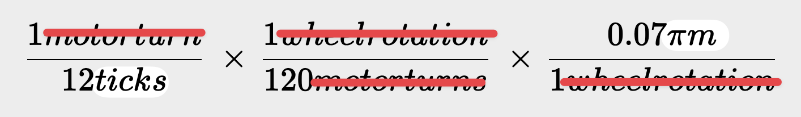
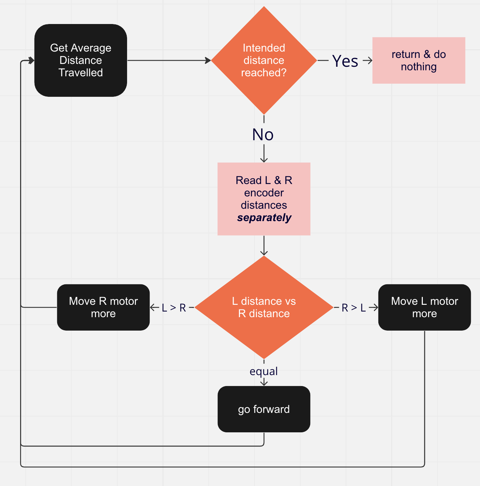

# ROMI Straight Autonomous Project
*By Eric Yang and Jayden Dai*

## Introduction
This project aims to code the ROMI robot to operate under basic teleop and drive automatically in autonomous. The ROMI's autonomous mode should drive the robot as straight as possible, for an intended distance. How long & fast the robot should go can be tweaked via changing the EncoderConstants.py file.

## ROMI calculations
This project involves using encoders to ensure accurate movement of the ROMI robot. Calculating the distance represented by each tick of the encoder is crucial to building the closed autonomous feedback loop that will drive the ROMI as forward as possible for precisely 2.0 meters. We consulted Getting To Know Your ROMI for details of the wheels and how much it travels every rotation. We then converted distanced traveled per rotation into per tick since we know how many ticks are in a rotation. Below is our equation and calculation:

We concluded that the motor travels 0.07pi meters/12*120 ticks or ~0.000153 meters per tick. Passing this constant into the setDistancePerPulse() for both encoders now allows us to directly get how much each motor has travelled with the getDistance() function. We can also get the distance travelled from both encoders and average it to use as the condition for exiting the closed-feedback autonomous loop.
## Development Structure & Autonomous Logic
During initial programming we knew that things will be tweaked many times. We think the practice of storing constants in a separate file just like the 7407 robot will make this a lot easier. During testing, we could tweak the constants file and everything dependent on it will automatically update. 

